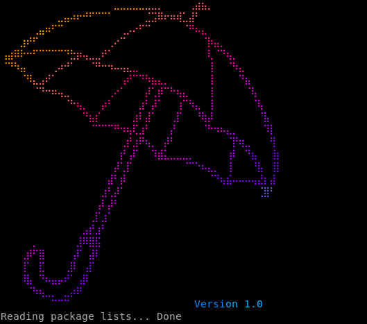
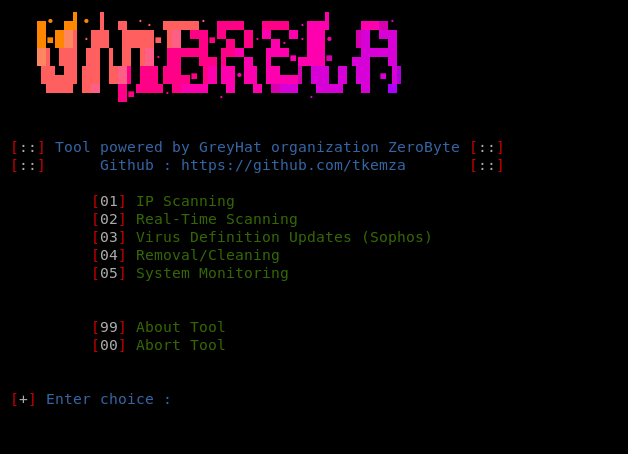
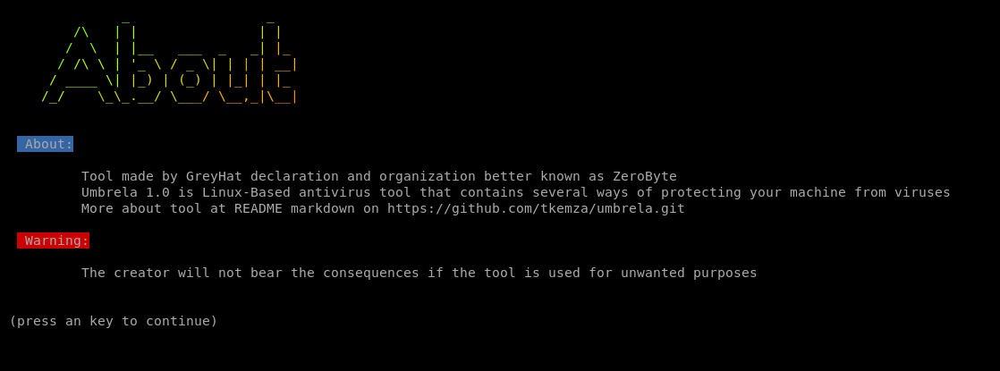

# UMBRELA 1.0

 Tool made by GreyHat Organization and Declaration better known as ZeroByte!

 Antivirus Linux-Based Tool, simple and easy to use! 

-----
# ABOUT 

## Umbrela: Your Fast and Easy Linux-Based Security Tool

 `Umbrela` is a cutting-edge Linux-based tool designed to streamline the process of simulating and managing viruses, unwanted directories, and files Engineered with simplicity and speed in mind, Umbrela offers a user-friendly interface and powerful functionality, making 
 it a valuable asset for anyone looking to maintain a secure and clean system environment.

## Key Features

 `Intuitive Interface`: Umbrela is built with ease of use at its core. Its straightforward interface allows users to quickly navigate through its features, ensuring that managing system security is as hassle-free as possible. 

 `Efficient Virus Simulation`: Unlike traditional antivirus tools, Umbrela focuses on simulating virus behavior to help you understand how potentia threats might impact your system. This feature is invaluable for testing and training purposes, providing a safe environment to observe an analyze malicious activities. 

 `Unwanted Files and Directories Management`: Umbrela excels at identifying and handling unwanted files and directories. Whether you need to clea up temporary files, quarantine suspicious files, or remove obsolete directories, Umbrela’s fast and reliable algorithms ensure that your syste remains organized and efficient. 

 `Speed and Performance`: Designed for high performance, Umbrela delivers rapid scanning and processing, minimizing downtime and maximizing   productivity. Its optimized engine ensures that even large-scale operations are executed swiftly without compromising accuracy. 

 `Customizable Settings`: Tailor Umbrela to fit your specific needs with customizable settings. Whether you’re managing a small personal system or  large network, Umbrela provides the flexibility to adjust parameters and preferences for optimal results. 
 Comprehensive Logging: Keep track of all operations with Umbrela’s detailed logging system. Each action is recorded with timestamps and relevant information, providing a clear audit trail for review and analysis. 

## Use Cases
 `System Administrators`: Simplify the management of system security by simulating threats and cleaning up unwanted files with minimal effort Umbrela helps ensure that your systems are both secure and clutter-free.

 `Security Analysts`: Use Umbrela to create a controlled environment for testing and analyzing malware behavior. Its simulation features are perfec for understanding and demonstrating potential threats.

 `Everyday Users`: Enjoy a cleaner, more organized system by using Umbrela to handle temporary files and directories. Its ease of use makes i accessible to users of all levels, ensuring that system maintenance is straightforward and efficient.

## Getting Started
 `Install Umbrela`: Download and install Umbrela from the official repository or website.
 Configure Settings: Adjust the tool’s settings to match your specific needs and preferences.
 Run Scans and Simulations: Utilize Umbrela’s features to simulate viruses, manage files, and clean up your system.
 Review Logs: Check the comprehensive logs to understand the actions taken and any issues encountered.
 Umbrela is your go-to solution for efficient system security and file management. With its user-centric design and powerful capabilities, it ensures that maintaining a secure and organized Linux environment has never been easier.

 For more information and to download `Umbrela v1.0`, visit [https://github.com/tkemza/umbrela/releases].

-----
# REQUIREMENTS

- `Git`

- `Wget`

- `Nmap`

-----
# CLONING

 To clone `Umbrela v1.0` ripository, simply input following commands in your terminal:

    git clone https://github.com/tkemza/umbrela.git

-----
# USAGE

 Go to `Umbrela v1.0` clonned directory

    cd umbrela

 Now give sudo permissions to tool

    chmod +x umbrela.sh

 And start the tool

    bash umbrela.sh

-----
# PREVIEW

# REPORT A BUG

 If you have any issue while running or using this tool, conctact me at:

    tkemaz.git@proton.me

 Any issues will be fixed in upcoming `version 2.0`

-----
# GPL-3.0 LICENSE

`GPL-3.0 LICENSE` (c) 2024 `tkemza`
